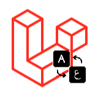

<h1 align="center">
   
  
   
    Laravel Easy Localize
   
</h1>

a VS Code Extension for Easily Localize any blade/php text in any Laravel project.

  
  
  <!---
  
  -->

## Features

- Custom array key for each translation.
- Auto detect duplicated array keys.
- Auto detect current file type to replace selection with the proper directive/method.
- Auto creation of lang/ar/localize.php directory if doesn't exists (arabic localization by default, but localize.php can be re-used).
- Auto detect invalid localize.php & auto fix without losing content.

## Usage

## Current Limitations & Future Work

- It only reads & writes to /resources/lang/ar/localize.php file, cannot select custom location.
- No support for nested array keys (ex: key1.key2).
- you tell me.

## Release Notes

### 1.0.0

Initial release.

### 1.0.1

- Fixed 'undefined' array key bug.
